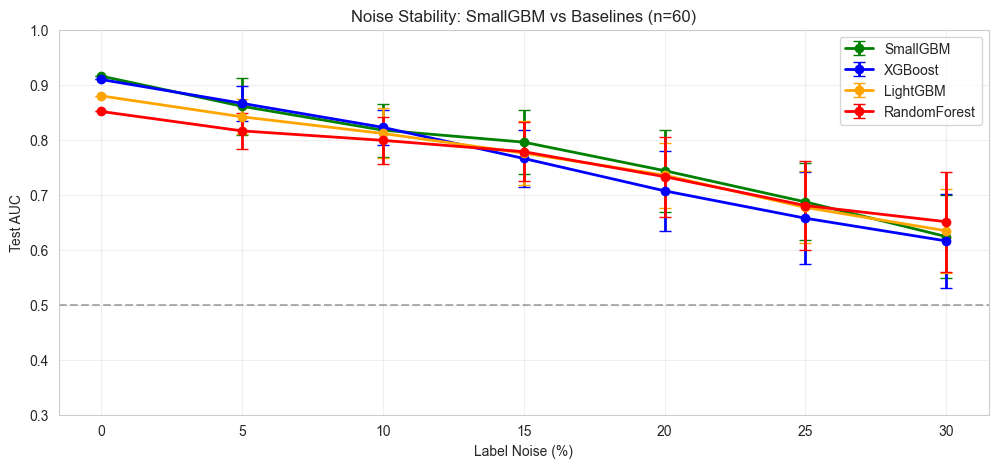
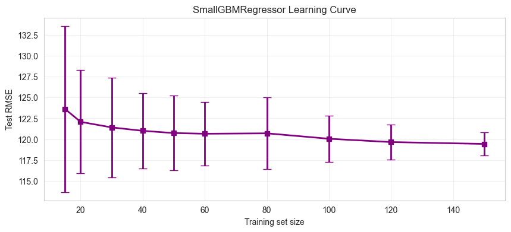

# SmallGBM

<p align="center">
  <b>Gradient boosting that actually works on small data.</b>
</p>

<p align="center">
  
  
  
  
</p>

---

## Why SmallGBM?

XGBoost and LightGBM are built for scale. They shine on thousands of rows. But when you only have **50, 100, or 500 samples**, their default hyperparameters fail — overfitting, instability, unpredictable results.

**SmallGBM** is designed from the ground up for datasets with fewer than 1000 samples.

| Feature                      | SmallGBM | XGBoost | LightGBM |
| ---------------------------- | -------- | ------- | -------- |
| Bayesian leaf weights        | ✅       | ❌      | ❌       |
| Adaptive regularization      | ✅       | ❌      | ❌       |
| No bootstrap (uses all data) | ✅       | ❌      | ❌       |
| Stable under label noise     | ✅       | ❌      | ❌       |
| scikit-learn compatible      | ✅       | ✅      | ✅       |

---

## Noise Stability

SmallGBM degrades gracefully when labels are noisy — unlike XGBoost and LightGBM which drop sharply.

<p align="center">
  
</p>

*At 20% label noise, SmallGBM is the best performer. Bayesian regularization keeps it stable when others collapse.*

---

## Learning Curve

Clear, predictable improvement as data grows. Reliable performance starts at **n ≈ 40**.

<p align="center">
  
</p>

*No sudden jumps, no catastrophic failures. A safe choice when data is limited.*

---

## Installation

```bash
pip install smallgbm
```

## Quickstart

```python
from smallgbm import SmallGBMClassifier

model = SmallGBMClassifier()
model.fit(X_train, y_train)
proba = model.predict_proba(X_test)
```

## API

### SmallGBMClassifier

| Parameter            | Default | Description               |
| -------------------- | ------- | ------------------------- |
| `n_estimators`     | 50      | Number of boosting rounds |
| `max_depth`        | 3       | Maximum tree depth        |
| `min_samples_leaf` | 3       | Minimum samples per leaf  |
| `learning_rate`    | 0.1     | Shrinkage factor          |
| `sigma_prior`      | 0.5     | Bayesian prior strength   |

### SmallGBMRegressor

Same parameters, for regression tasks.

```python
from smallgbm import SmallGBMRegressor

model = SmallGBMRegressor()
model.fit(X_train, y_train)
preds = model.predict(X_test)
```

---

## Research

Full characterisation notebook with 5 experiments: `benchmark_final.ipynb`

- Noise stability analysis
- Prior sensitivity
- Sample size curve
- Regression performance
- Class imbalance tolerance

---

## License

MIT © [Emelyanov Ilya](https://github.com/nsdmlk) 2026

---

<p align="center">
  <sub>Built with ❤️ for the small data community</sub>
</p>
